<div align="center">

# 🔐 Authentication, Authorization, JWT, Sessions & Cookies
### Complete Exam + Technical Interview Guide (MERN Stack)


> 📌 *Diagrams use **Mermaid** (renders on GitHub, VS Code with Markdown Preview Mermaid, Typora, Obsidian). Badges need internet.*

</div>

---

# 📑 Detailed Table of Contents

| # | Topic | Icon |
|---|-------|------|
| 1 | [Authentication vs Authorization](#1-authentication-vs-authorization) | 🪪 |
| 2 | [Stateful vs Stateless](#2-stateful-vs-stateless) | 🧠 |
| 3 | [Why do we need JWT?](#3-why-do-we-need-jwt) | ❓ |
| 4 | [JWT Structure in Detail](#4-jwt-structure-in-detail) | 🧩 |
| 5 | [Public Key & Private Key (with Example)](#5-public-key--private-key) | 🔑 |
| 6 | [Types of JWT: Access, Refresh, Rotation (MERN)](#6-types-of-jwt-in-mern-stack) | 🎟️ |
| 7 | [Where to store JWT on the client?](#7-where-to-store-jwt-on-the-client-side) | 🗄️ |
| 8 | [Why Session & Token? (Login for every page problem)](#8-why-do-we-need-session-and-token) | 🚪 |
| 9 | [Cookies vs Session vs Token: storage, need, types](#9-cookies-vs-session-vs-token) | 🍪 |
| 10 | [Man-in-the-Middle (MITM) & HTTPS prevention](#10-man-in-the-middle-mitm-attack-and-prevention) | 🕵️ |
| 11 | [Interview Q&A (Rapid Fire)](#11-interview-qa-rapid-fire) | 🎤 |
| 12 | [Cheat Sheet & Summary](#12-cheat-sheet--summary) | 📝 |

---

# 1. Authentication vs Authorization

## 🌍 Simple real-world example: Airport ✈️

| Step | Airport | Web App | Concept |
|------|---------|---------|---------|
| 1 | Security guard checks your **passport** | Server checks **username + password** | **Authentication** (Who are you?) |
| 2 | Boarding pass says **Economy / Business** | Token says role = `user` / `admin` | **Authorization** (What can you do?) |
| 3 | Economy passenger can't enter **Business Lounge** | Normal user can't open `/admin` | Access denied → **403** |

```
   🪪  AUTHENTICATION                🚦  AUTHORIZATION
   "Who are you?"                    "What are you allowed to do?"
   ─────────────────                 ────────────────────────────
   Login (email + password)          Role check (admin / user)
   OTP, Biometrics, SSO              Permissions (read / write / delete)
   Happens FIRST                     Happens AFTER authentication
   Fail → 401 Unauthorized           Fail → 403 Forbidden
```

## 🏨 Another analogy: Hotel

- **Authentication** = Reception verifies your ID and gives you a **key card**.
- **Authorization** = The key card opens **only your room**, not other rooms or the manager's office.

## 📊 Comparison table (Exam favourite)

| Feature | 🪪 Authentication (AuthN) | 🚦 Authorization (AuthZ) |
|---|---|---|
| Question answered | Who are you? | What can you access? |
| Purpose | Verify identity | Verify permissions |
| Order | First | Second |
| Input | Credentials (password, OTP, biometrics) | Roles, policies, scopes |
| Visible to user | Yes (login form) | Mostly no (behind the scenes) |
| HTTP status on failure | **401 Unauthorized** | **403 Forbidden** |
| Example tech | JWT, Session, OAuth login, Passport.js | RBAC, ACL, ABAC, OAuth scopes |
| Changes during session? | Usually no | Can change (role updated) |

## 🧰 Types of Authentication
1. **Password based** (username + password, hashed with bcrypt/argon2)
2. **MFA / 2FA** (password + OTP / authenticator app)
3. **Biometric** (fingerprint, face)
4. **Token based** (JWT, opaque tokens)
5. **Session based** (session id in cookie)
6. **SSO / OAuth 2.0 / OpenID Connect** (Login with Google)
7. **Passwordless / Passkeys (WebAuthn)**
8. **API keys / Certificates (mTLS)**

## 🧰 Types of Authorization
1. **RBAC**: Role Based Access Control (`admin`, `editor`, `user`)
2. **ABAC**: Attribute Based (department = HR AND time < 6pm)
3. **ACL**: Access Control List (per resource)
4. **Scope based** (OAuth: `read:profile`, `write:posts`)

## 💻 Code: AuthN vs AuthZ middleware (Express)

```js
// 🪪 AUTHENTICATION: is the token valid? who is the user?
function authenticate(req, res, next) {
  const header = req.headers.authorization;          // "Bearer <token>"
  if (!header) return res.status(401).json({ msg: "Not logged in" });
  try {
    const token = header.split(" ")[1];
    req.user = jwt.verify(token, process.env.ACCESS_SECRET); // { sub, role }
    next();
  } catch (e) {
    return res.status(401).json({ msg: "Invalid or expired token" });
  }
}

// 🚦 AUTHORIZATION: does this user have permission?
const authorize = (...allowedRoles) => (req, res, next) => {
  if (!allowedRoles.includes(req.user.role))
    return res.status(403).json({ msg: "Forbidden: insufficient role" });
  next();
};

app.delete("/users/:id", authenticate, authorize("admin"), deleteUser);
```

## 🎤 Interview one-liner
> *"Authentication verifies **identity** (401 on failure); Authorization verifies **permissions** (403 on failure). Authentication always comes first."*

---

# 2. Stateful vs Stateless

## 🌍 Simple real-world example: Restaurant 🍽️

### 🧠 Stateful = the **same waiter** remembers you
You sit at table 5. Waiter Raju remembers: *"Table 5 ordered 2 pizzas, no onions."*
If Raju goes on break and a **new waiter** comes, he knows **nothing** → your order is lost.

> The **server remembers** the client (state is stored on the server).

### 🪶 Stateless = you carry a **written order slip**
Every time, you hand over a slip: *"Table 5, 2 pizzas, no onions."*
**Any waiter** can read the slip and serve you. Nobody needs to remember you.

> The **client sends all info** in each request (state lives in the token/request).

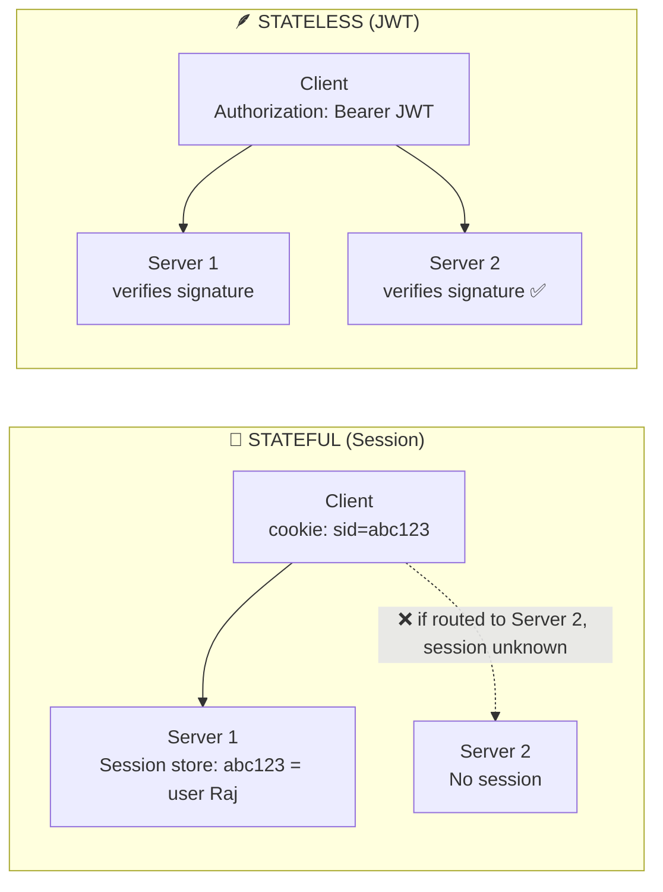

## 📊 Detailed comparison

| Feature | 🧠 Stateful (Session) | 🪶 Stateless (JWT) |
|---|---|---|
| Where is user data? | Server memory / Redis / DB | Inside the token (client) |
| Client holds | Only a **session ID** | The **whole token** with claims |
| Server lookup per request | ✅ Yes (DB/Redis hit) | ❌ No (just verify signature) |
| Horizontal scaling | Hard (needs sticky sessions or shared Redis) | Easy (any server can verify) |
| Logout / revoke | Easy (delete the session) | Hard (token valid until it expires) |
| Token size | Tiny (session id) | Bigger (header + payload + signature) |
| Memory usage on server | High with many users | Very low |
| Security control | Full server control | Needs short expiry + refresh strategy |
| Best for | Traditional web apps, admin panels | REST APIs, microservices, mobile apps, SPAs |
| HTTP itself | HTTP is **stateless by design**, sessions *add* state on top | Natural fit with HTTP |

## 🔍 Stateful example (Express-session)

```js
app.use(session({
  secret: process.env.SESSION_SECRET,
  resave: false,
  saveUninitialized: false,
  store: MongoStore.create({ mongoUrl: process.env.MONGO_URI }),
  cookie: { httpOnly: true, secure: true, maxAge: 1000 * 60 * 60 }
}));

app.post("/login", async (req, res) => {
  // ... verify password
  req.session.userId = user._id;   // ✅ state stored on SERVER
  res.json({ ok: true });          // browser only gets Set-Cookie: connect.sid=...
});
```

## 🔍 Stateless example (JWT)

```js
app.post("/login", async (req, res) => {
  // ... verify password
  const token = jwt.sign({ sub: user._id, role: user.role }, process.env.ACCESS_SECRET, { expiresIn: "15m" });
  res.json({ token });             // ✅ nothing stored on server
});
```

## 🎤 Interview one-liner
> *"Stateful servers remember clients (session store); stateless servers remember nothing, every request carries everything needed (JWT). Stateless scales better; stateful revokes better."*

---

# 3. Why do we need JWT?

## 🐢 The problem with sessions at scale

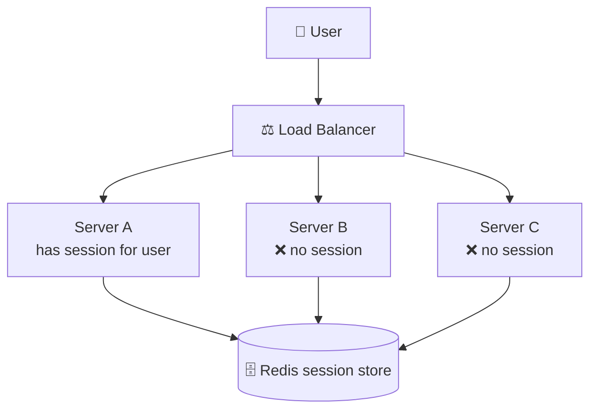

Problems:
1. **Scaling**: each server needs shared session storage (Redis) or sticky sessions.
2. **DB lookup on every request** → latency and load.
3. **Microservices**: 10 services all need access to the same session DB.
4. **Mobile apps / third-party APIs**: cookies are awkward; need a portable credential.
5. **Cross-domain** (`api.example.com` and `app.other.com`) is painful with cookies.

## ✅ What JWT solves

| Need | How JWT helps |
|---|---|
| Stateless auth | Server verifies signature, no DB lookup |
| Scalability | Any server with the key can verify |
| Microservices | Auth service issues token, all services verify it |
| Mobile / SPA / API | Send in `Authorization: Bearer` header |
| Carry data | Claims (userId, role) travel inside the token |
| Tamper-proof | Signature detects any modification |
| Cross-domain / SSO | Token can be accepted by many apps |
| Expiry built-in | `exp` claim |

## 🌍 Simple example: Cinema ticket 🎫
A cinema ticket contains **movie, seat, time** and a **hologram stamp** (signature).
The gate guard does **not call the ticket office** to verify; he only checks the stamp. That is JWT.

## ⚠️ JWT is NOT perfect
- Cannot be easily revoked before expiry.
- Payload is **encoded, not encrypted** (anyone can read it).
- Bigger than a session ID.
- If stolen, works until expiry → keep it **short-lived**.

---

# 4. JWT Structure in Detail

**JWT = JSON Web Token** (RFC 7519). It has **3 parts** separated by dots:

```
xxxxx.yyyyy.zzzzz
HEADER.PAYLOAD.SIGNATURE
```

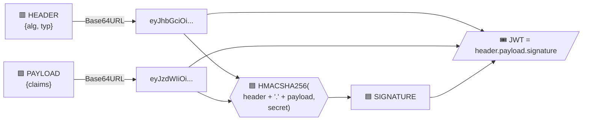

## 🎨 A real JWT

```
eyJhbGciOiJIUzI1NiIsInR5cCI6IkpXVCJ9.eyJzdWIiOiI2NGYxYTJiMyIsInJvbGUiOiJhZG1pbiIsImlhdCI6MTcwMDAwMDAwMCwiZXhwIjoxNzAwMDAwOTAwfQ.Xq3k...signature...
└──────────── 🟥 HEADER ───────────┘ └──────────────────────────── 🟪 PAYLOAD ───────────────────────────┘ └── 🟦 SIGNATURE ──┘
```

## 🟥 Part 1: Header

```json
{
  "alg": "HS256",
  "typ": "JWT"
}
```

| Key | Meaning | Values |
|---|---|---|
| `alg` | Signing algorithm | `HS256` (shared secret), `RS256` (RSA key pair), `ES256` (ECDSA) |
| `typ` | Token type | `JWT` |
| `kid` (optional) | Key ID, which key signed it (key rotation) | `"key-2026-01"` |

## 🟪 Part 2: Payload (Claims)

```json
{
  "sub": "64f1a2b3c4d5e6f7a8b9c0d1",
  "name": "Rahul",
  "role": "admin",
  "iat": 1700000000,
  "exp": 1700000900,
  "iss": "myapp.com",
  "aud": "myapp-client"
}
```

### Types of claims

| Type | Description | Examples |
|---|---|---|
| **Registered** (standard) | Predefined, recommended | `iss` issuer, `sub` subject, `aud` audience, `exp` expiry, `nbf` not before, `iat` issued at, `jti` unique id |
| **Public** | Registered in IANA registry / collision-resistant names | `email`, `name` |
| **Private** (custom) | Agreed between your client and server | `role`, `tenantId`, `permissions` |

> ⚠️ **Never put passwords, credit-card numbers or secrets in the payload.** It is only Base64URL **encoded**, not encrypted.

## 🟦 Part 3: Signature

```
HMACSHA256(
   base64UrlEncode(header) + "." + base64UrlEncode(payload),
   secret
)
```

- Guarantees **integrity** (data not modified) and **authenticity** (issued by the key owner).
- If an attacker changes `"role":"user"` to `"role":"admin"`, the signature no longer matches → **rejected**.

## 🔄 Verification flow

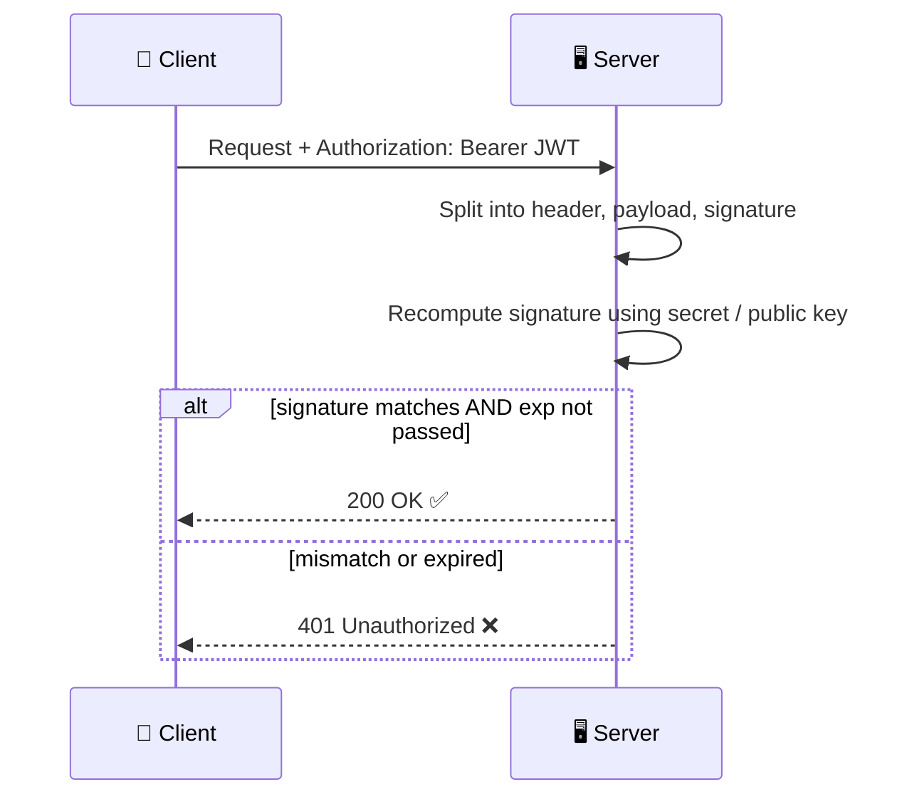

## 🔬 Base64URL vs Base64
- Replaces `+` → `-`, `/` → `_`, removes `=` padding, so it is safe in URLs and headers.
- **Encoding ≠ Encryption.** Anyone can decode: `Buffer.from(part, "base64url").toString()`.

## 🧪 Node.js demo

```js
const jwt = require("jsonwebtoken");

const token = jwt.sign(
  { sub: "u123", role: "admin" },   // payload
  "mySecret",                       // secret
  { algorithm: "HS256", expiresIn: "15m", issuer: "myapp.com" }
);

console.log(jwt.decode(token, { complete: true })); // decode (NO verification!)
console.log(jwt.verify(token, "mySecret"));         // verify signature + exp
```

## 🚨 Common JWT vulnerabilities (interview!)

| Attack | Description | Fix |
|---|---|---|
| `alg: none` attack | Attacker sets algorithm none, no signature | Always pass `algorithms: ["HS256"]` in verify |
| Algorithm confusion | Switch RS256 → HS256 using the public key as secret | Whitelist algorithms |
| Weak secret | Brute-forced HS256 key | Use 256-bit+ random secret |
| Sensitive data in payload | Payload is readable | Store only ids/roles |
| No expiry | Token valid forever | Always set `exp` |
| Token in localStorage | XSS steals it | HttpOnly cookie / memory |

---

# 5. Public Key & Private Key

## 🌍 Simple example: Letterbox 📮 + Padlock 🔒

### Analogy 1: Public mailbox
- **Public key** = your **mailbox address & slot**. Anyone can drop a letter in (encrypt).
- **Private key** = the **key to open the mailbox**. Only you can read the letters (decrypt).

### Analogy 2: Signing (used in JWT RS256) ✍️
- **Private key** = your **personal signature stamp** (only you own it).
- **Public key** = a **signature specimen card** given to everyone.
- You stamp a document (**sign** with private key). Anyone compares with the specimen card (**verify** with public key) → proves **you** signed and it was **not modified**.

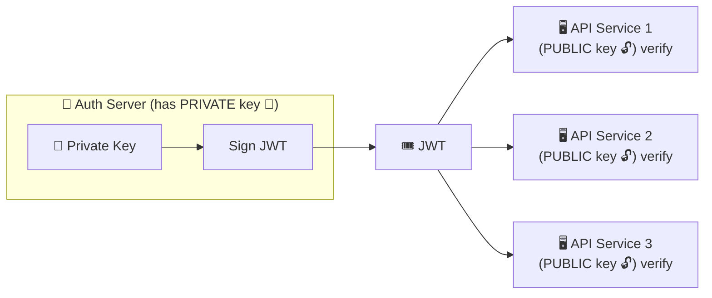

## 🔁 Symmetric vs Asymmetric

| Feature | 🔑 Symmetric (HS256) | 🔐🔓 Asymmetric (RS256 / ES256) |
|---|---|---|
| Keys | **One shared secret** | **Key pair**: private + public |
| Sign with | Secret | Private key |
| Verify with | Same secret | Public key |
| Who can create tokens? | Anyone with the secret | Only the private key holder |
| Who can verify? | Anyone with the secret (also can forge!) | Anyone with the public key (cannot forge) |
| Speed | Faster | Slower |
| Use case | Single backend / monolith | Microservices, third parties, OAuth/OIDC providers |
| Key distribution | Risky (secret shared everywhere) | Safe (public key can be published, e.g. JWKS) |

## 🧮 How the math is used (concept)
- **Encryption**: `ciphertext = encrypt(message, PUBLIC key)` → `decrypt(ciphertext, PRIVATE key)`
- **Signature**: `signature = sign(hash(data), PRIVATE key)` → `verify(signature, PUBLIC key)`
- JWT uses the **signature** direction: not to hide data but to prove authenticity.

## 💻 Full example: RS256 in Node.js

### Step 1: Generate keys

```bash
openssl genrsa -out private.pem 2048
openssl rsa -in private.pem -pubout -out public.pem
```

### Step 2: Auth server signs with PRIVATE key

```js
const fs = require("fs");
const jwt = require("jsonwebtoken");

const privateKey = fs.readFileSync("private.pem");

const token = jwt.sign(
  { sub: "u123", role: "user" },
  privateKey,
  { algorithm: "RS256", expiresIn: "15m", keyid: "key-1" }
);
```

### Step 3: Any API verifies with PUBLIC key

```js
const publicKey = fs.readFileSync("public.pem");

try {
  const payload = jwt.verify(token, publicKey, { algorithms: ["RS256"] });
  console.log("✅ valid", payload);
} catch (err) {
  console.log("❌ invalid", err.message);
}
```

## 🎯 Real-world sample scenario
An **Auth service** owns `private.pem`. **Orders**, **Payments** and **Chat** microservices only have `public.pem`. Even if the Orders service is hacked, the attacker **cannot create** valid tokens because they lack the private key. With HS256, a hacked service that shares the secret could forge admin tokens.

## 🌐 JWKS (JSON Web Key Set)
Providers like Google/Auth0 publish public keys at `/.well-known/jwks.json`. Clients fetch them by `kid`, which enables **key rotation** with zero downtime.

---

# 6. Types of JWT in MERN Stack

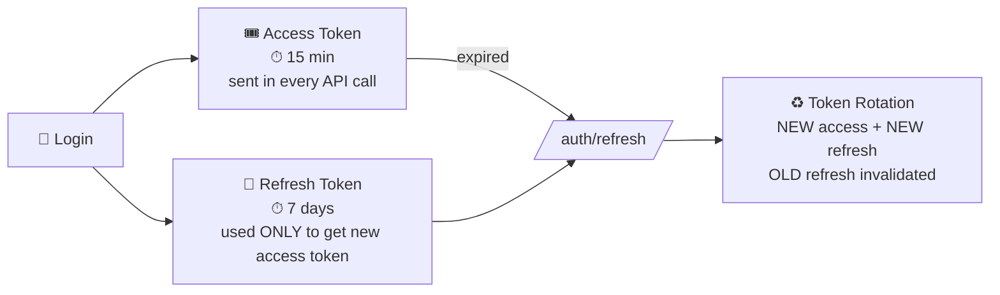

## 📦 Project setup (MERN)

```bash
npm i express mongoose jsonwebtoken bcryptjs cookie-parser cors dotenv
```

`.env`
```
ACCESS_SECRET=super_long_random_string_1_min_32_chars
REFRESH_SECRET=another_super_long_random_string_2
ACCESS_EXPIRES=15m
REFRESH_EXPIRES=7d
```

Generate strong secrets:
```bash
node -e "console.log(require('crypto').randomBytes(64).toString('hex'))"
```

---

## 🎟️ 6.1 ACCESS TOKEN

### What is it?
Short-lived token sent with **every protected API request** to prove "I am logged in".

### Structure

| Part | Value |
|---|---|
| Header | `{ "alg": "HS256", "typ": "JWT" }` |
| Lifetime | **5-15 minutes** |
| Secret | `ACCESS_SECRET` |
| Sent via | `Authorization: Bearer <token>` header |
| Stored (client) | **JavaScript memory** (React state/variable) |

### Payload: Key & Value data

```json
{
  "sub":   "64f1a2b3c4d5e6f7a8b9c0d1",   // user _id (MongoDB ObjectId)
  "email": "rahul@example.com",
  "role":  "user",                       // "user" | "admin"
  "type":  "access",                     // distinguishes from refresh
  "iat":   1700000000,                   // issued at (auto)
  "exp":   1700000900,                   // expiry (auto, +15m)
  "iss":   "myapp.com"
}
```

| Key | Value example | Why |
|---|---|---|
| `sub` | user `_id` | identifies the user |
| `role` | `"admin"` | authorization decisions |
| `type` | `"access"` | prevents using refresh token as access |
| `iat`/`exp` | timestamps | expiry check |
| `iss` | `"myapp.com"` | who issued |

### Generate in Express

```js
// utils/tokens.js
const jwt = require("jsonwebtoken");

exports.signAccessToken = (user) =>
  jwt.sign(
    { sub: user._id.toString(), email: user.email, role: user.role, type: "access" },
    process.env.ACCESS_SECRET,
    { expiresIn: process.env.ACCESS_EXPIRES, issuer: "myapp.com" }
  );
```

### Verify middleware

```js
// middleware/auth.js
const jwt = require("jsonwebtoken");

module.exports = (req, res, next) => {
  const auth = req.headers.authorization || "";
  const token = auth.startsWith("Bearer ") ? auth.slice(7) : null;
  if (!token) return res.status(401).json({ msg: "No token" });

  try {
    const payload = jwt.verify(token, process.env.ACCESS_SECRET, {
      algorithms: ["HS256"], issuer: "myapp.com",
    });
    if (payload.type !== "access") throw new Error("wrong token type");
    req.user = payload;
    next();
  } catch (err) {
    const expired = err.name === "TokenExpiredError";
    res.status(401).json({ msg: expired ? "Token expired" : "Invalid token" });
  }
};
```

### React: send it (Axios)

```js
// api.js
import axios from "axios";
let accessToken = null;                       // 🧠 in memory
export const setAccessToken = (t) => (accessToken = t);

export const api = axios.create({ baseURL: "https://api.myapp.com", withCredentials: true });

api.interceptors.request.use((cfg) => {
  if (accessToken) cfg.headers.Authorization = `Bearer ${accessToken}`;
  return cfg;
});
```

---

## 🔄 6.2 REFRESH TOKEN

### What is it?
Long-lived token used **only** to obtain a new access token. Never sent to normal APIs.

### Structure

| Part | Value |
|---|---|
| Header | `{ "alg": "HS256", "typ": "JWT" }` |
| Lifetime | **7-30 days** |
| Secret | `REFRESH_SECRET` (**different** from access secret) |
| Sent via | **HttpOnly, Secure, SameSite cookie** to `/auth/refresh` only |
| Stored (server) | MongoDB, **hashed** (so it can be revoked) |
| Stored (client) | HttpOnly cookie (JS can't read it) |

### Payload: Key & Value data

```json
{
  "sub":  "64f1a2b3c4d5e6f7a8b9c0d1",
  "type": "refresh",
  "jti":  "b9a7c1e0-3f2d-4c11-9a8e-7d6c5b4a3f21",  // unique token id (uuid)
  "fam":  "f5c1d2e3-....",                          // token family id (for rotation)
  "iat":  1700000000,
  "exp":  1700604800                                // +7 days
}
```

> Keep the refresh payload **minimal**: no role/email. Its only job is identification.

### Mongoose model (server-side record)

```js
// models/RefreshToken.js
const mongoose = require("mongoose");

const refreshSchema = new mongoose.Schema({
  user:       { type: mongoose.Schema.Types.ObjectId, ref: "User", index: true },
  jti:        { type: String, unique: true },   // token id
  family:     { type: String, index: true },    // login-session family
  tokenHash:  String,                           // sha256 of the token
  revoked:    { type: Boolean, default: false },
  replacedBy: String,                           // jti of the next token (rotation chain)
  userAgent:  String,
  ip:         String,
  expiresAt:  { type: Date, index: { expires: 0 } }, // Mongo TTL auto-delete
}, { timestamps: true });

module.exports = mongoose.model("RefreshToken", refreshSchema);
```

### Generate + Login route

```js
// utils/tokens.js (continued)
const crypto = require("crypto");
const { v4: uuid } = require("uuid");

exports.sha256 = (s) => crypto.createHash("sha256").update(s).digest("hex");

exports.signRefreshToken = (userId, family = uuid()) => {
  const jti = uuid();
  const token = jwt.sign(
    { sub: userId.toString(), type: "refresh", jti, fam: family },
    process.env.REFRESH_SECRET,
    { expiresIn: process.env.REFRESH_EXPIRES }
  );
  return { token, jti, family };
};
```

```js
// routes/auth.js
const cookieOpts = {
  httpOnly: true,                       // JS cannot read (XSS protection)
  secure: true,                         // HTTPS only
  sameSite: "strict",                   // CSRF protection ("none" for cross-site + secure)
  path: "/auth",                        // sent ONLY to /auth/* routes
  maxAge: 7 * 24 * 60 * 60 * 1000,
};

router.post("/login", async (req, res) => {
  const { email, password } = req.body;
  const user = await User.findOne({ email });
  if (!user || !(await bcrypt.compare(password, user.passwordHash)))
    return res.status(401).json({ msg: "Invalid credentials" });

  const accessToken = signAccessToken(user);
  const { token: refreshToken, jti, family } = signRefreshToken(user._id);

  await RefreshToken.create({
    user: user._id, jti, family,
    tokenHash: sha256(refreshToken),
    userAgent: req.get("user-agent"), ip: req.ip,
    expiresAt: new Date(Date.now() + 7 * 864e5),
  });

  res.cookie("refreshToken", refreshToken, cookieOpts)
     .json({ accessToken, user: { id: user._id, email: user.email, role: user.role } });
});
```

---

## ♻️ 6.3 TOKEN ROTATION

### What is it?
Every time the refresh token is used, the server issues a **brand-new refresh token** and **invalidates the old one**. If an **old token is used again** (reuse), it means it was **stolen**, so the server **revokes the whole family** and forces re-login.

### Why?
A stolen refresh token is normally valid for 7+ days. With rotation, it is valid for **one use only**.

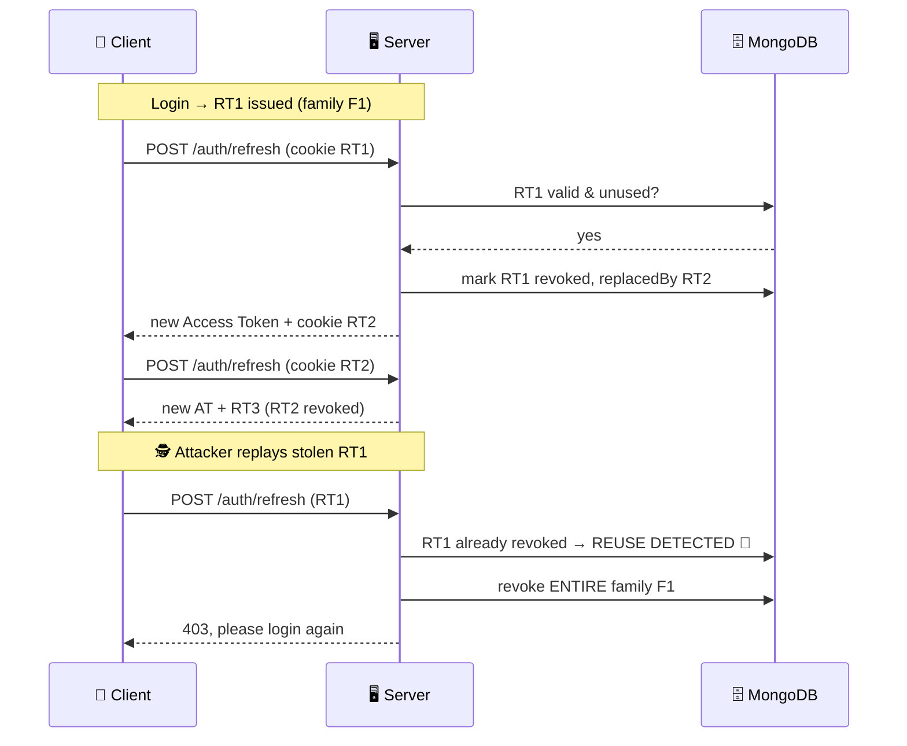

### Data (key/value) of a rotation chain in DB

| jti | family | revoked | replacedBy | Note |
|---|---|---|---|---|
| `rt-001` | `F1` | `true` | `rt-002` | used at login |
| `rt-002` | `F1` | `true` | `rt-003` | first refresh |
| `rt-003` | `F1` | `false` | `null` | ✅ current valid one |

### Refresh route with rotation + reuse detection

```js
router.post("/refresh", async (req, res) => {
  const incoming = req.cookies.refreshToken;
  if (!incoming) return res.status(401).json({ msg: "No refresh token" });

  let payload;
  try {
    payload = jwt.verify(incoming, process.env.REFRESH_SECRET, { algorithms: ["HS256"] });
    if (payload.type !== "refresh") throw new Error();
  } catch {
    return res.status(401).json({ msg: "Invalid refresh token" });
  }

  const record = await RefreshToken.findOne({ jti: payload.jti });

  // 🚨 REUSE DETECTION: token not in DB or already used
  if (!record || record.revoked || record.tokenHash !== sha256(incoming)) {
    await RefreshToken.updateMany({ family: payload.fam }, { revoked: true }); // kill family
    res.clearCookie("refreshToken", { path: "/auth" });
    return res.status(403).json({ msg: "Token reuse detected. Please login again." });
  }

  const user = await User.findById(payload.sub);
  if (!user) return res.status(401).json({ msg: "User not found" });

  // ♻️ ROTATE: issue new refresh token in the SAME family
  const { token: newRefresh, jti: newJti } = signRefreshToken(user._id, payload.fam);
  record.revoked = true;
  record.replacedBy = newJti;
  await record.save();

  await RefreshToken.create({
    user: user._id, jti: newJti, family: payload.fam,
    tokenHash: sha256(newRefresh),
    userAgent: req.get("user-agent"), ip: req.ip,
    expiresAt: new Date(Date.now() + 7 * 864e5),
  });

  res.cookie("refreshToken", newRefresh, cookieOpts)
     .json({ accessToken: signAccessToken(user) });
});

router.post("/logout", async (req, res) => {
  const t = req.cookies.refreshToken;
  if (t) {
    const p = jwt.decode(t);
    if (p?.fam) await RefreshToken.updateMany({ family: p.fam }, { revoked: true });
  }
  res.clearCookie("refreshToken", { path: "/auth" }).json({ msg: "Logged out" });
});
```

### React: silent refresh (Axios interceptor)

```js
api.interceptors.response.use(
  (res) => res,
  async (error) => {
    const original = error.config;
    if (error.response?.status === 401 && !original._retry) {
      original._retry = true;
      try {
        const { data } = await axios.post("/auth/refresh", {}, { withCredentials: true });
        setAccessToken(data.accessToken);                       // new AT in memory
        original.headers.Authorization = `Bearer ${data.accessToken}`;
        return api(original);                                   // retry
      } catch {
        setAccessToken(null);
        window.location.href = "/login";
      }
    }
    return Promise.reject(error);
  }
);
```

### 📊 Access vs Refresh vs Rotation summary

| Feature | 🎟️ Access Token | 🔄 Refresh Token | ♻️ Rotation |
|---|---|---|---|
| Purpose | Access APIs | Get new access token | Make refresh tokens single-use |
| Lifetime | 5-15 min | 7-30 days | n/a (policy) |
| Secret | ACCESS_SECRET | REFRESH_SECRET | n/a |
| Sent to | All protected routes | `/auth/refresh` only | n/a |
| Client storage | Memory | HttpOnly cookie | n/a |
| Server storage | None (stateless) | DB (hashed) | DB chain (jti, family, replacedBy) |
| Revocable | Expires quickly | Yes (DB) | Yes (family revoke) |
| If stolen | 15 min risk | Long risk | Detected on reuse ✅ |

---

# 7. Where to store JWT on the Client Side?

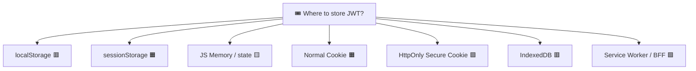

## 1️⃣ localStorage

```js
localStorage.setItem("token", token);
const t = localStorage.getItem("token");
```
- ✅ Easy, persists after browser restart, 5-10 MB.
- ❌ **Readable by any JS** → **XSS steals token** (`localStorage.getItem`), including 3rd-party scripts/npm packages.
- ❌ Never expires automatically.
- ✅ Immune to CSRF (not sent automatically).
- **Verdict:** 🔴 Not recommended for sensitive tokens.

## 2️⃣ sessionStorage
```js
sessionStorage.setItem("token", token);
```
- ✅ Cleared when tab closes; per-tab isolation.
- ❌ Still **vulnerable to XSS**; lost on new tab.
- **Verdict:** 🟠 Slightly better than localStorage, still XSS-prone.

## 3️⃣ In-memory (JS variable / React state / Context)
```js
let accessToken = null;   // lives only while page is open
```
- ✅ **Not accessible by other scripts via storage APIs**, no persistence to steal, no CSRF.
- ❌ Lost on page refresh (solve using refresh-token cookie → silent refresh).
- ⚠️ XSS can still *use* the app to make requests while the page is open, but can't exfiltrate a long-lived token.
- **Verdict:** 🟢 **Best for access token.**

## 4️⃣ Normal Cookie (`document.cookie`)
```js
document.cookie = "token=abc; path=/; max-age=900";
```
- ✅ Auto-sent with requests, expiry support.
- ❌ JS can read → **XSS vulnerable**; CSRF vulnerable unless `SameSite`.
- **Verdict:** 🟠 Avoid for JWT.

## 5️⃣ HttpOnly + Secure + SameSite Cookie (set by server)
```js
res.cookie("refreshToken", token, { httpOnly: true, secure: true, sameSite: "strict" });
```
- ✅ **JavaScript cannot read it** → XSS cannot steal it.
- ✅ Browser handles sending & expiry automatically.
- ⚠️ CSRF risk → mitigate with `SameSite=Strict/Lax`, CSRF token, and only using it on `/auth/refresh`.
- ⚠️ 4 KB size limit.
- **Verdict:** 🟢 **Best for refresh token.**

## 6️⃣ IndexedDB / Cache API
- Same problem as localStorage: readable by any JS on origin. 🔴 Not recommended.

## 7️⃣ Service Worker / BFF (Backend-for-Frontend)
- The **BFF** (Next.js/Node proxy) keeps tokens server-side and gives the browser only an HttpOnly session cookie. Most secure, more complex. 🟢 (enterprise)

## 📊 Comparison table

| Storage | JS readable | XSS risk | CSRF risk | Survives refresh | Survives browser close | Verdict |
|---|---|---|---|---|---|---|
| localStorage | ✅ | 🔴 High | 🟢 None | ✅ | ✅ | ❌ Avoid |
| sessionStorage | ✅ | 🔴 High | 🟢 None | ✅ | ❌ | ⚠️ Weak |
| Memory (variable) | ❌ (no API) | 🟡 Low | 🟢 None | ❌ | ❌ | ✅ Best (access) |
| Normal cookie | ✅ | 🔴 High | 🔴 Yes | ✅ | Depends | ❌ Avoid |
| **HttpOnly cookie** | ❌ | 🟢 Protected | 🟡 Needs SameSite | ✅ | ✅ | ✅ Best (refresh) |
| IndexedDB | ✅ | 🔴 High | 🟢 None | ✅ | ✅ | ❌ Avoid |
| BFF | ❌ | 🟢 | 🟡 | ✅ | ✅ | ✅ Enterprise |

## 🏆 THE BEST PRACTICE (Interview answer)

```
┌───────────────────────────────────────────────────────────────┐
│  🎟️ ACCESS TOKEN   → JavaScript MEMORY (React state)          │
│                       short life (15 min), sent via Bearer    │
│                                                               │
│  🔄 REFRESH TOKEN  → HttpOnly + Secure + SameSite cookie      │
│                       path=/auth, rotated on every use        │
└───────────────────────────────────────────────────────────────┘
```

**On page refresh:** memory is wiped → React calls `POST /auth/refresh` on app load → cookie sent automatically → new access token in memory. ✅

### Attack matrix

| Attack | localStorage | Memory + HttpOnly cookie |
|---|---|---|
| XSS steals token | ✅ Stolen | ❌ Cannot read the refresh token |
| CSRF | ❌ | Mitigated (SameSite, refresh-only path, CORS) |

> Also: use **CSP**, sanitize input (DOMPurify), avoid `dangerouslySetInnerHTML`, audit npm packages.

---

# 8. Why do we need Session and Token?

## 🌍 The problem: HTTP is stateless 🧊
Every HTTP request is **independent**. The server does **not remember** that you logged in one second ago.

### ❌ Without session/token: password on every page

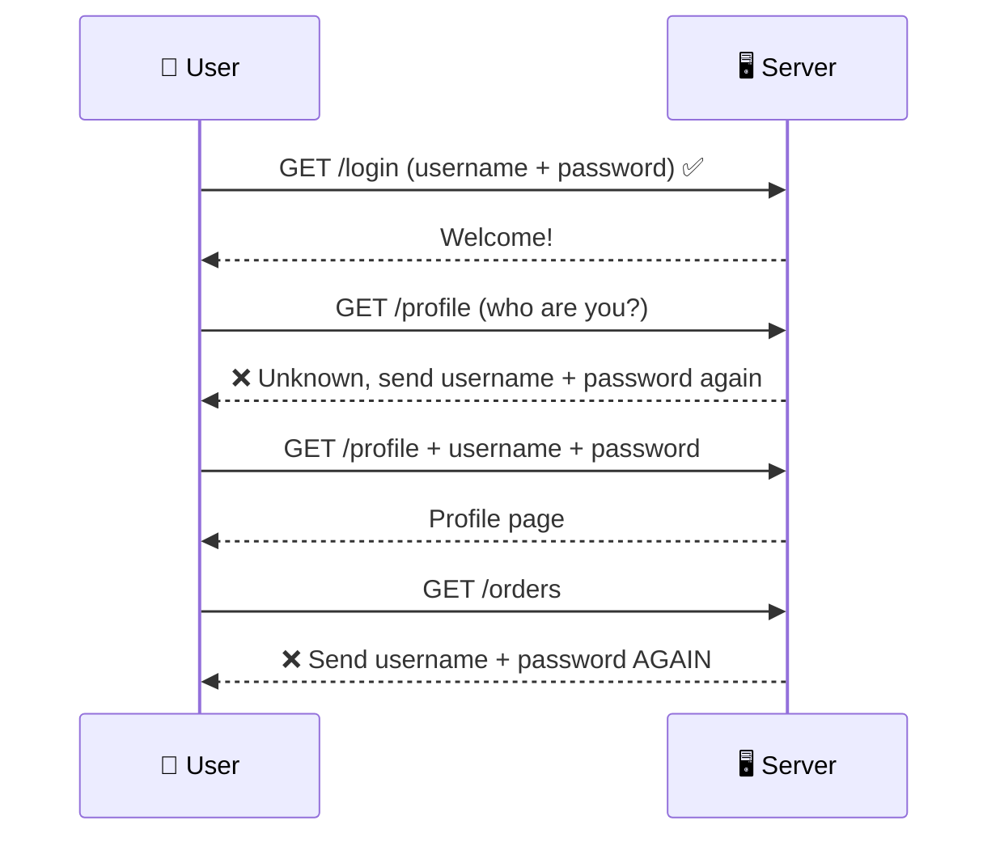

Imagine typing your password on **every page, every click, every API call** (100+ times per session)! 😫
Also sending the password repeatedly = **more chances to steal it**.

### ✅ With session/token: login once

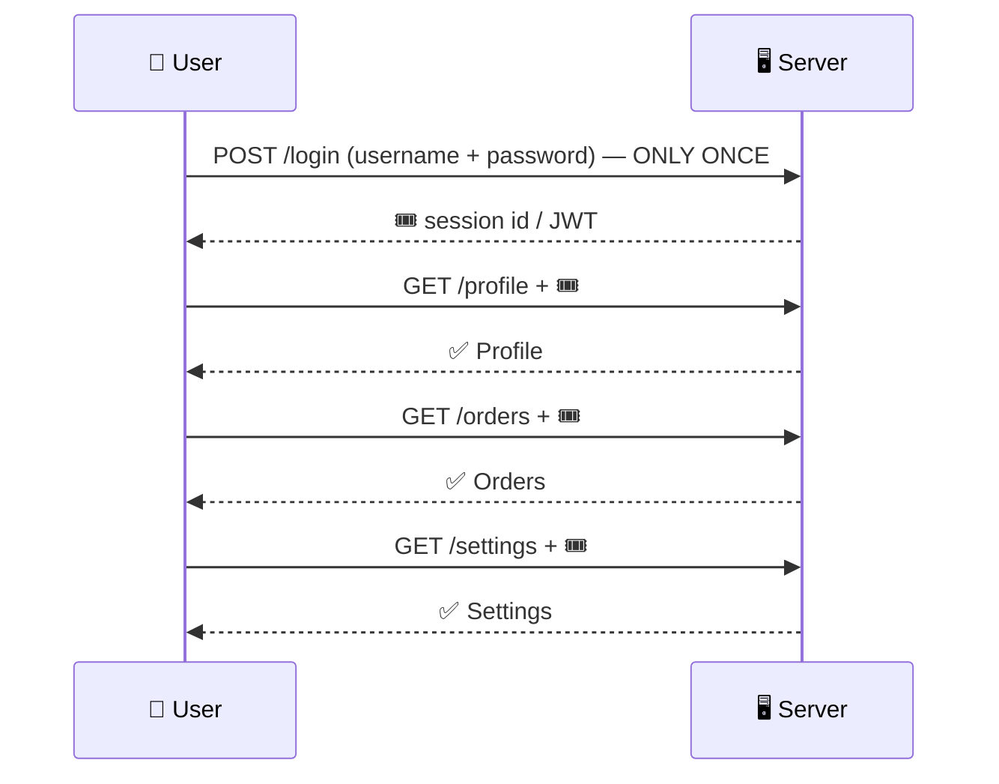

## 🎬 Analogy: Amusement park wristband 🎡
You show your **ID & pay once** at the gate (login). You get a **wristband** (session/token). All rides just scan the wristband, nobody asks for your ID or money again.

## 🎯 Benefits

| Benefit | Explanation |
|---|---|
| Login once | Better UX |
| Password sent once | Less exposure |
| Expiry | Wristband stops working after time |
| Revocation / logout | Destroy session or token |
| Authorization data | Role/permissions attached |
| Tracking | Cart, preferences, activity |
| Different clients | Web, mobile, IoT use the same token |

---

# 9. Cookies vs Session vs Token

## 🧭 Big picture: they are NOT competitors, they are different layers

```
🍪 COOKIE   = a STORAGE + TRANSPORT mechanism in the browser (small key=value data, auto-sent)
🧠 SESSION  = STATE kept on the SERVER, identified by a session ID
🎟️ TOKEN    = a self-contained CREDENTIAL kept on the CLIENT (e.g. JWT)
```

Common combos:
- **Session ID stored in a Cookie** (classic web apps)
- **JWT stored in a Cookie** (server-rendered / refresh token)
- **JWT stored in memory + sent in header** (SPA/mobile)

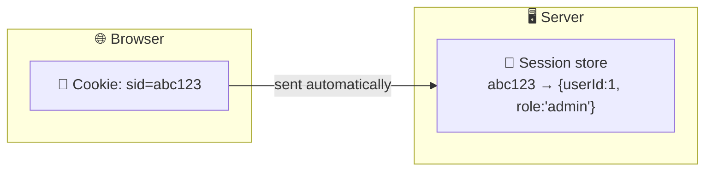

---

## 🍪 9.1 COOKIES

### What is it?
A small piece of data (max ~4 KB) that the **server sends** via `Set-Cookie`, the browser stores it and **sends back automatically** in the `Cookie` header on every matching request.

### Need
- Remember login (session id), preferences (theme, language), cart, analytics, ads.

### How to store

**Server (Express):**
```js
res.cookie("theme", "dark", {
  maxAge: 24 * 60 * 60 * 1000,  // 1 day
  httpOnly: true,               // block JS access
  secure: true,                 // HTTPS only
  sameSite: "lax",              // CSRF protection
  domain: ".myapp.com",
  path: "/",
});
```

**Raw HTTP:**
```
Set-Cookie: sid=abc123; Max-Age=3600; Path=/; Secure; HttpOnly; SameSite=Strict
```

**Client (JS, only non-HttpOnly):**
```js
document.cookie = "theme=dark; max-age=86400; path=/";
```

### Cookie attributes

| Attribute | Purpose |
|---|---|
| `Expires` / `Max-Age` | Lifetime (no value = session cookie) |
| `Domain` | Which domain/subdomains receive it |
| `Path` | URL path scope |
| `Secure` | Only sent over HTTPS |
| `HttpOnly` | Not accessible with `document.cookie` (XSS defence) |
| `SameSite` | `Strict` / `Lax` / `None`: CSRF defence |
| `Partitioned` (CHIPS) | Per-top-site storage for third-party cookies |
| Prefixes `__Host-` / `__Secure-` | Enforce secure attributes |

### 🍪 Types of Cookies

| Type | Description | Example |
|---|---|---|
| **Session cookie** | No expiry; deleted when browser closes | login state |
| **Persistent cookie** | Has `Expires`/`Max-Age` | "Remember me" |
| **Secure cookie** | Only over HTTPS | auth cookies |
| **HttpOnly cookie** | Not readable by JS | refresh token |
| **SameSite cookie** | Restricts cross-site sending | CSRF protection |
| **First-party cookie** | Set by the site you visit | myapp.com login |
| **Third-party cookie** | Set by another domain (ads, trackers) | ads.example |
| **Supercookie / Zombie cookie** | Hard-to-delete tracking (⚠️ privacy) | tracking |
| **Signed cookie** | Value + HMAC signature to detect tampering | `cookie-parser` signed |

---

## 🧠 9.2 SESSION

### What is it?
A **server-side record** of a logged-in user. The browser only holds a **session ID** (random, unguessable), usually in a cookie.

### Need
Remember user across requests securely without exposing data to the client. Full control (destroy on logout).

### How it works

```mermaid
sequenceDiagram
    participant B as 🌐 Browser
    participant S as 🖥️ Server
    participant R as 🗄️ Session Store (Redis/Mongo)
    B->>S: POST /login (email, password)
    S->>R: create session { id: abc123, userId: 42 }
    S-->>B: Set-Cookie: sid=abc123; HttpOnly
    B->>S: GET /profile (Cookie: sid=abc123)
    S->>R: find abc123
    R-->>S: { userId: 42 }
    S-->>B: Profile data
    B->>S: POST /logout
    S->>R: delete abc123
```

### How to store
| Location | Notes |
|---|---|
| Server **memory** | Default in express-session, ❌ not for production (lost on restart, no scaling) |
| **Database** (MongoDB via connect-mongo) | Persistent |
| **Redis** | Fast, TTL support: ✅ most popular |
| File system | Rare |

### Types of sessions

| Type | Description |
|---|---|
| Server-side session | Data on server, ID in cookie (classic) |
| Client-side session | Data inside cookie itself (signed/encrypted), e.g. `cookie-session` |
| Persistent session | Survives browser close ("remember me") |
| Temporary/anonymous session | Guest cart before login |
| Sticky session | Load balancer routes same user to the same server |
| Distributed session | Shared store (Redis) across servers |

---

## 🎟️ 9.3 TOKEN

### What is it?
A string that **represents identity/permission**, given after login; client presents it on each request.

### Need
Stateless APIs, mobile apps, microservices, third-party access, SSO.

### How to store (client)
Memory (access token) + HttpOnly cookie (refresh token) → see [Section 7](#7-where-to-store-jwt-on-the-client-side).

### Types of tokens

| Token | Description | Example |
|---|---|---|
| **Opaque token** | Random string; meaning stored on server (must look up) | `a8f3...` (like a session id) |
| **JWT (self-contained)** | Data + signature inside token | `eyJ...` |
| **Access token** | Short-lived, calls API | 15 min |
| **Refresh token** | Long-lived, gets new access tokens | 7 days |
| **ID token (OIDC)** | Proves who the user is (profile info) | Google Login |
| **Bearer token** | Whoever *bears* it can use it | `Authorization: Bearer ...` |
| **API key** | Long-lived key identifying an app | Stripe key |
| **CSRF token** | Random value to validate form/requests | `X-CSRF-Token` |
| **Reset / verification token** | One-time email links | password reset |
| **OTP / TOTP** | One-time code (SMS/authenticator) | 2FA |
| **PASETO / Macaroons** | Alternatives to JWT | modern systems |

---

## 📊 9.4 Big comparison: Cookie vs Session vs Token (JWT)

| Feature | 🍪 Cookie | 🧠 Session | 🎟️ JWT Token |
|---|---|---|---|
| What is it | Browser storage mechanism | Server-side user state | Self-contained credential |
| Data stored at | Browser | **Server** (ID in browser) | **Client** |
| Size limit | ~4 KB | Server limit | Header size (~8 KB practical) |
| Stateful? | n/a (transport) | ✅ Stateful | ❌ Stateless |
| Sent how | Automatically by browser | Via cookie (session id) | Manual header / cookie |
| Server lookup each request | No (just a value) | ✅ Yes | ❌ No (verify signature) |
| Revoke | Delete cookie / expire | ✅ Instant | ❌ Hard (blocklist/rotation) |
| Scale | Easy | Needs shared store | ✅ Easiest |
| Mobile app friendly | ❌ awkward | ❌ awkward | ✅ Yes |
| Cross-domain | Restricted (SameSite) | Restricted | ✅ Easy |
| CSRF risk | Yes | Yes (cookie based) | Only if stored in cookie |
| XSS risk | If not HttpOnly | If cookie not HttpOnly | If in localStorage |
| Best for | Preferences, session id | Traditional server apps | SPAs, APIs, microservices |

## 🧭 Decision guide
```
Server-rendered site (EJS/Next.js)?           → Session + HttpOnly cookie
SPA + API (React + Express)?                  → JWT access (memory) + refresh (HttpOnly cookie)
Mobile app / public API?                      → JWT / OAuth2 bearer
Need instant logout / high security (banking) → Server-side session or short JWT + revocation
Microservices?                                → JWT with RS256 + JWKS
```

---

# 10. Man-in-the-Middle (MITM) Attack and Prevention

## 🕵️ What is MITM?
An attacker sits **between client and server** (public Wi-Fi ☕, rogue router, ARP/DNS spoofing, malicious proxy) and **reads or modifies** traffic.

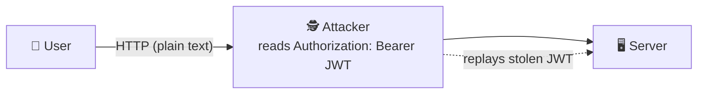

### 🌍 Simple example: Postcard vs sealed envelope ✉️
- **HTTP** = a **postcard**. The postman (attacker) reads everything, including your JWT/password.
- **HTTPS** = a **sealed, locked envelope**. The postman only sees the address, not the content.

## ⚠️ What can the attacker do with a stolen JWT?
- **Replay** it: act as the user until `exp`.
- Read the payload (it's only Base64 encoded).
- Cannot **modify** it (signature breaks), but does not need to.

## 🛡️ Solution 1: HTTPS (TLS): encrypt requests ✅ (main answer)

With HTTPS (HTTP over **TLS**), everything (URL path, headers incl. `Authorization`, cookies, body) is **encrypted**. The attacker only sees encrypted bytes + server IP/domain (SNI).

### 🔒 TLS handshake (simplified)

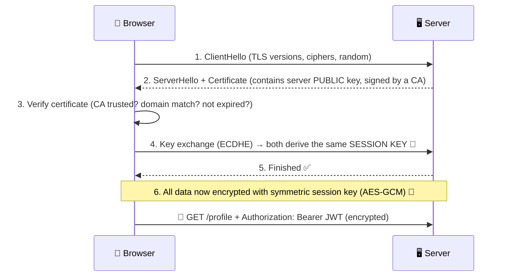

**Key ideas:**
- **Asymmetric crypto** (certificate/public key) authenticates the server & exchanges keys ([Section 5](#5-public-key--private-key) in action!).
- **Symmetric crypto** (AES) encrypts actual data (fast).
- **Certificate Authority (CA)** vouches that the public key really belongs to `myapp.com`, so an attacker's fake certificate shows a browser warning ⚠️.
- **Forward secrecy (ECDHE)**: past traffic can't be decrypted even if the server key leaks later.

### Force HTTPS in Express

```js
const helmet = require("helmet");
app.set("trust proxy", 1);                       // behind nginx/heroku
app.use(helmet.hsts({ maxAge: 31536000, includeSubDomains: true, preload: true }));

app.use((req, res, next) => {
  if (!req.secure) return res.redirect(301, "https://" + req.headers.host + req.url);
  next();
});
```

## 🛡️ Full defence checklist (Defence in depth)

| # | Defence | How it helps |
|---|---|---|
| 1 | **HTTPS/TLS everywhere** (TLS 1.2+/1.3) | Encrypts traffic, MITM can't read JWT |
| 2 | **HSTS** header | Browser refuses HTTP; prevents SSL-stripping downgrade |
| 3 | **HSTS preload** | Even first visit is HTTPS |
| 4 | **`Secure` cookie flag** | Cookie never sent over HTTP |
| 5 | **`HttpOnly` cookie flag** | JS/XSS can't read token |
| 6 | **`SameSite=Strict/Lax`** | CSRF protection |
| 7 | **Short-lived access token** (5-15 min) | Limits replay window |
| 8 | **Refresh token rotation + reuse detection** | Stolen refresh token detected/revoked |
| 9 | **Token binding / fingerprint**: bind to IP range, User-Agent, or device (e.g. hashed fingerprint cookie inside `jti`/claim) | Stolen token unusable from another device |
| 10 | **Certificate validation** (mobile: certificate pinning) | Blocks fake CAs |
| 11 | **Never send tokens in URL** (`?token=`) | URLs are logged in history/proxies/Referer |
| 12 | **Server-side revocation list** (blocklist by `jti`) | Kill stolen tokens immediately |
| 13 | **DPoP / mTLS (sender-constrained tokens)** | Token useless without private key |
| 14 | **MFA / re-auth for sensitive actions** | Payment/password change needs OTP |
| 15 | **Monitoring & alerts** (new IP/device) | Detect misuse |
| 16 | **Don't trust public Wi-Fi / use VPN** | User-side protection |
| 17 | **Encrypt payload if sensitive (JWE)** | Content unreadable even if seen |
| 18 | **CSP, input sanitization** | Prevent XSS token theft (related attack) |

## ❓ "Is signing enough? Why HTTPS?"
| | Signature (JWT) | HTTPS (TLS) |
|---|---|---|
| Protects integrity of the token | ✅ | ✅ |
| Hides token contents | ❌ | ✅ |
| Prevents **replay/stealing** in transit | ❌ | ✅ (encrypted) |

> **Signing ≠ Encryption.** JWT signature stops **tampering**; **HTTPS** stops **eavesdropping**. You need both.

## 🧾 Sample secure config summary

```js
// Access token: memory + Bearer header, 15 min
// Refresh token: HttpOnly; Secure; SameSite=Strict; Path=/auth; rotated
// Whole site: HTTPS + HSTS
```

---

# 11. Interview Q&A (Rapid Fire)

<details>
<summary><b>Q1. Difference between authentication and authorization?</b></summary>

Authentication = verifying identity (who you are, 401). Authorization = verifying permissions (what you can do, 403). AuthN first, then AuthZ.
</details>

<details>
<summary><b>Q2. Stateful vs stateless auth?</b></summary>

Stateful (sessions): server stores state, client sends session ID. Stateless (JWT): all info in the token, server just verifies signature. Stateless scales better, stateful revokes easier.
</details>

<details>
<summary><b>Q3. What are the parts of JWT?</b></summary>

Header (alg, typ), Payload (claims), Signature. Joined by dots, first two are Base64URL encoded, signature = HMAC/RSA over `header.payload`.
</details>

<details>
<summary><b>Q4. Is JWT encrypted?</b></summary>

No. Standard JWT (JWS) is **signed, not encrypted**. Anyone can decode the payload. Use JWE for encryption, and never store secrets in the payload.
</details>

<details>
<summary><b>Q5. HS256 vs RS256?</b></summary>

HS256 uses one shared secret for sign and verify. RS256 uses private key to sign and public key to verify, so it is better for microservices and third parties.
</details>

<details>
<summary><b>Q6. How do you log out a user with JWT?</b></summary>

Delete client token, revoke refresh token in DB (family), optionally blocklist access token `jti` until expiry, keep access token short-lived.
</details>

<details>
<summary><b>Q7. Why use access + refresh tokens?</b></summary>

Short access token limits damage if stolen; refresh token gives good UX without re-login and can be revoked on the server.
</details>

<details>
<summary><b>Q8. What is refresh token rotation?</b></summary>

New refresh token issued on each use, old one invalidated. Reuse of an old one signals theft → revoke the whole token family.
</details>

<details>
<summary><b>Q9. Best place to store JWT?</b></summary>

Access token in memory, refresh token in HttpOnly + Secure + SameSite cookie. Avoid localStorage (XSS).
</details>

<details>
<summary><b>Q10. XSS vs CSRF?</b></summary>

XSS: attacker injects script that runs in your page and steals data (defence: HttpOnly, CSP, sanitize). CSRF: attacker tricks the browser into sending authenticated requests using cookies (defence: SameSite, CSRF token).
</details>

<details>
<summary><b>Q11. How to protect against MITM?</b></summary>

HTTPS/TLS + HSTS, Secure cookies, short-lived tokens, rotation, certificate pinning (mobile), never put tokens in URLs.
</details>

<details>
<summary><b>Q12. Session vs JWT: when to use which?</b></summary>

Session for server-rendered monoliths needing instant revoke; JWT for SPAs, mobile, microservices needing scalability.
</details>

<details>
<summary><b>Q13. What is the `alg: none` attack?</b></summary>

Attacker sets `alg` to `none` to skip signature verification. Fix: whitelist algorithms explicitly in `jwt.verify`.
</details>

<details>
<summary><b>Q14. What does `SameSite` do?</b></summary>

Controls if cookies are sent with cross-site requests: `Strict` (never), `Lax` (top-level GET navigations), `None` (always, needs `Secure`).
</details>

<details>
<summary><b>Q15. Why hash the refresh token in DB?</b></summary>

If the DB leaks, hashed tokens can't be used directly (same reason as password hashing).
</details>

<details>
<summary><b>Q16. How do you hash passwords?</b></summary>

With slow, salted algorithms: bcrypt, argon2, or scrypt. Never plain text, MD5 or SHA-1.
</details>

<details>
<summary><b>Q17. What are OAuth 2.0 and OpenID Connect?</b></summary>

OAuth 2.0 = authorization framework (delegated access via access tokens). OIDC = identity layer on OAuth 2.0 that adds an ID token (JWT) for authentication.
</details>

---

# 12. Cheat Sheet & Summary

## 🗺️ Complete flow (MERN)

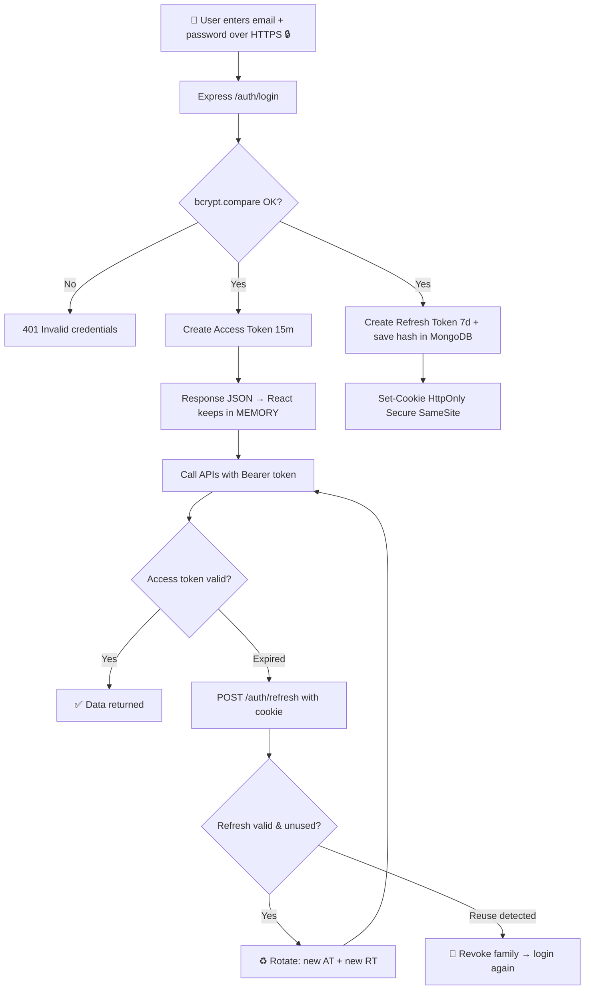

## 📝 One-page cheat sheet

| Topic | Remember |
|---|---|
| AuthN | Who are you → 401 |
| AuthZ | What can you do → 403 |
| Stateful | Server remembers (session) |
| Stateless | Token carries everything (JWT) |
| JWT parts | `header.payload.signature` |
| JWT ≠ encrypted | Only Base64URL encoded and signed |
| HS256 | 1 shared secret |
| RS256 | Private signs, public verifies |
| Access token | 15 min, in memory, Bearer header |
| Refresh token | 7 d, HttpOnly cookie, DB hashed, rotated |
| Rotation | One-time use + reuse detection → revoke family |
| Best storage | AT → memory; RT → HttpOnly Secure SameSite cookie |
| Cookie flags | `HttpOnly`, `Secure`, `SameSite`, `Path`, `Max-Age` |
| MITM defence | HTTPS + HSTS + short expiry + rotation + Secure cookies |
| Never | Token in URL, secrets in payload, localStorage for auth, plain HTTP |

## ✅ Final security checklist

- [ ] Passwords hashed with bcrypt/argon2
- [ ] HTTPS + HSTS enabled
- [ ] Strong, separate secrets for access and refresh tokens (or RS256)
- [ ] Algorithms whitelisted in `jwt.verify`
- [ ] Access token 5-15 minutes
- [ ] Refresh token in HttpOnly + Secure + SameSite cookie, path-restricted
- [ ] Refresh tokens hashed in DB, rotated, reuse detection
- [ ] Rate limiting on `/login` and `/refresh` (`express-rate-limit`)
- [ ] CORS restricted to your frontend origin (`credentials: true`)
- [ ] `helmet` + CSP enabled
- [ ] Input validation/sanitization
- [ ] RBAC checks on the **server** for every protected route

---

<div align="center">

### 🎯 Golden line for interviews
**"Login once → get short-lived access token (memory) + rotating refresh token (HttpOnly cookie) → everything over HTTPS."**

Made for exam revision and technical interviews 🚀

</div>
